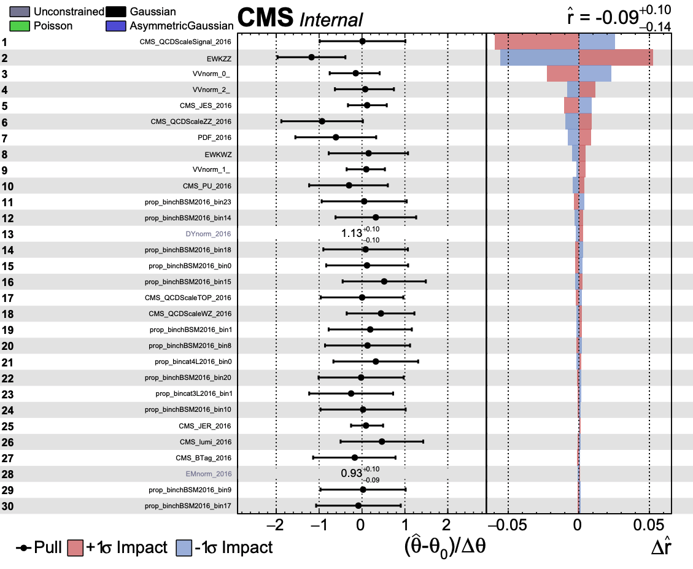

Running Combine
---------------

.. image:: ../img/combine.png
      :width: 900
      :alt: Alternative text

Combine is a powerful tool with many different applications. For this excercise we will focus on 3 particular uses below:

1. Creation of Impact plots to see the effects of various systematic uncertainties
2. As a fitDiagnostics tool to check the normalization after the fit
3. To find the limits of our various signal samples

Impact Plots
************

The first step is to look at the impact of the systematic uncertainties. Combine allows the processes/bins to fluctuate according to the magnitude of the uncertainties. As such, the uncertainties can have each impact the results in different ways depending on the magnitude of the uncertainty and the processes/bins that they effect. The idea of the impact plot is to look at the effect of these uncertainties given a specific signal and signal strength (r). The impact plots will also order the uncertainties with the largest impacts so that we get a nice summary of the uncertainties.

Let's run some impact plots:

.. code-block:: html

      combineTool.py -M Impacts -d workspace_TEST.root -m 125 -n TEST --robustFit 1 --X-rtd FITTER_DYN_STEP --rMin=-1 --rMax=4 --doInitialFit --allPars $PARAM;
      combineTool.py -M Impacts -d workspace_TEST.root -m 125 -n TEST --robustFit 1 --X-rtd FITTER_DYN_STEP --rMin=-1 --rMax=4 --doFits --allPars $PARAM;
      combineTool.py -M Impacts -d workspace_TEST.root -m 125 -n TEST -o impactsTEST.json --allPars $PARAM;
      plotImpacts.py -i impactsTEST.json -o impactsTEST;

After running the plotImpacts.py file you should have a summary of the actual impacts themselves. It should look something like this:

In this sample you can see what a typical impact plot looks like. Here r stands for the signal strength. In the leftmost column you should see a list of various systematic uncertainties (hopefully you will recognize these from the datacars!). The middle column shows the pull values of the uncertainties. This column effectively shows how far off the nominal value combine is using for the fit (if combine were to only use the nominal values then all values here would be 1). The last column is the effect of the systematic uncertainty on the actual signal strength r. If an uncertainty can have a large effect on the signal strength then this delta r value gets larger. This last column takes into account both the up and down fluctuations of the uncertainty. For this plot, the uncertainties are ordered by their effect on the signal strength. There are several more uncertainites than this but only the first page was necessary here as an example.

FitDiagnostics
**************

The next step to try is to look at the fitdiagnostics part of combine. This will form a diagnostics file where you can look at the different ways that we fit the background. The three main categories are:

1. prefit (this is without any normalization from combine)
2. postfit_b (This is with the normalizations given from combine assuming there is background only)
3. postfit_s (This is with the normalizations given from combine assuming there is background and signal)

You can create the diagnostics file using the following command:

.. code-block:: html

      combine -M FitDiagnostics workspace_TEST.root -n 'MonoZ' --plots --saveNorm --saveShapes --saveWithUncertainties --saveOverall

This should output a ROOT file named after 'MonoZ' in the command above. Now we can look at this ROOT file and see different normalized distributions. Go ahead and explore it a little bit. What processes are available in the file? What about data? We will use this diagnostic file to make some plots in the next section but you should make yourself comfortable with it now.

Running the Limits
******************

This is the bread and butter of the combine tool. Here we will find the limits on the signal samples. This is done with a command like the following:

.. code-block:: html

      combine -M AsymptoticLimits --datacard workspace_TEST.root -m 125 -t -1 --name "process name" --rMax=5 --rMin=-10 --cminFallbackAlgo Minuit2,Migrad,0:0.05 --X-rtd MINIMIZER_analytic --X-rtd FAST_VERTICAL_MORPH

Here you need to make sure the process in the workspace_TEST.root is the same as <process name>. This will create limits for this sepcific sample. There should output like below:

.. code-block:: sh

     <<< Combine >>> 
     Configured fallback algorithm , type Minuit2, algo Migrad, strategy 0, tolerance 0.05
     >>> method used is AsymptoticLimits
     >>> random number generator seed is 123456
      
      -- AsymptoticLimits ( CLs ) --
     Observed Limit: r < 0.2752
     Expected  2.5%: r < 0.1162
     Expected 16.0%: r < 0.1684
     Expected 50.0%: r < 0.2754
     Expected 84.0%: r < 0.4927
     Expected 97.5%: r < 0.8347
      
     Done in 0.03 min (cpu), 0.03 min (real)

The output shown above is quite important! Here the r again represents the signal strength. The respective lines are explained below(not necessarily in the same order):

1. **Expected 50.0%**: This is the expected result if the data matched the MC prediction
2. **Observed limit**: This is the limit attained after unblinding the signal region and testing the data against the prediction
3. **Expected 16.0% and 84%**: These are the plus and minus 1 sigma results for the expected limit
4. **Expected 2.5% and 97.5%**: These are the plus and minus 2 sigma results for the expected limit

Now we have a limit on the signal strength of a DM model! This limit takes into account the data collected at CMS and all the uncertainties related to the collection of that data as well as the uncertainties in the prediction. This is the actual result of the analysis! The next step is to get these for the all of the DM samples available to us. In order to run over all the samples we can use the runcombine.py file here:`combine <https://github.com/yhaddad/CMSDAS-MonoZ-Tutorial/blob/master/runcombine.py>`_.

This will give output for all of the DM samples available. From here we can make summary plots as discussed in the Results section.

Postfit Plotting
~~~~~~~~~~~~~~~~

Once we have this FitDiagnostics file from the instructions above we can start to look at the distributions pre-fit and post-fit. Lets do this through the SWAN tool here:

`SWAN <https://swan.web.cern.ch/swan/>`_.

Click on the large link and a menu should appear. The environment is fine as it is naturally configured so hit the "start my session" button. Here you can start new projects and open jupyter notebooks to write code. The advantage of swan is that it is hosted with eos so we have access to all of our files. We will use this tool to do the plotting from this point. You can grab the code you will need here:

`Github <https://github.com/yhaddad/CMSDAS-MonoZ-Tutorial-2024>`_.

Starting
********

The file we will start with is the CMSDAS_Postfit.ipynb

In this file make sure you connect the correct pathway to your diagnostics file. Then go ahead and execute each of the sections. This is currently configured to look at the 4L control region and then the signal region where we combine the 2 jet categories into a single histogram.

Find these lines:

.. code-block:: html

     channel = "cat4L"
     #fit_type = "prefit"
     fit_type = "fit_b"

Here you can modify the fit type to look at the pre-fit and the post-fit using either background only or background and signal. You can also look at the other categories specifically the 3L and 4L regions. Go ahead and look at these now. How does the pre-fit compare to the post-fit? How is the agreement in the different regions?

